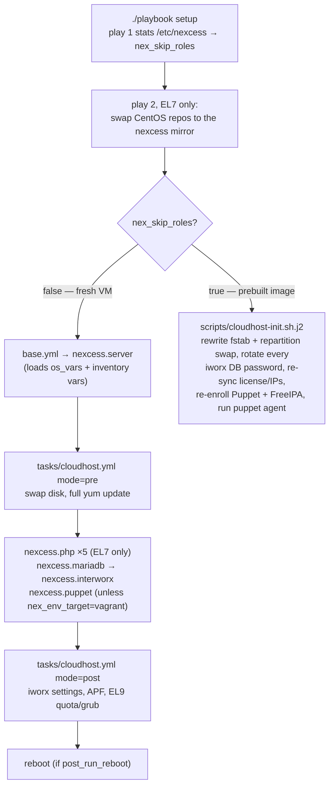

# ansible-playbook-cloudhost

Ansible playbooks that install and manage Nexcess CloudHost servers with InterWorx.

## Architecture in a paragraph

Every CloudHost build needs InterWorx, multi-version PHP, MariaDB, and Puppet enrollment stood up
identically, so this repo owns that sequence. **Most of what runs is not in this repo**: `roles/`
and `inventories/` are both gitignored. Roles are fetched by `ansible-galaxy` from
[`requirements.yml`](requirements.yml) — five, all applied, plus four that arrive as `meta/main.yml`
dependencies of `nexcess.server` and `nexcess.php` (`nexcess.firewall`, `nexcess.kernelcare`,
`nexcess.repo-epel`, `nexcess.repo-remi` — each conditional, and `kernelcare_included` defaults
false, so being pulled in is not the same as running). Inventories are supplied by the caller. What
this repo contributes is the orchestration: which roles run in which order, the InterWorx-specific
`nodeworx`/`ini.pex` glue the roles don't cover, and the variable plumbing that feeds both. Four
things drive it: [`./playbook <name>`](playbook) for a real inventory,
[`spec/test.sh`](spec/test.sh) for CI in a systemd Docker container,
[`local-testing/`](local-testing/README.md) for a manual Rocky 9 VM run, and the
[`Vagrantfile`](Vagrantfile) for a CentOS 7 box. All four install the galaxy roles, but only the
first goes through the `./playbook` wrapper, and only the wrapper *wipes* the installed roles before
reinstalling and fetches the puppet-config Hiera YAML — so on the other three a stale role directory
persists and the Hiera vars are absent unless passed another way. Note too that
`setup.yml`/`base.yml` target `hosts: cloudhost,saashost` while `import.yml` and
`install-app.yml` target `cloudhost` alone — `group_vars/cloudhost.yml` never reaches a `saashost`.

## Variables

Seven sources, lowest precedence first: upstream role `defaults/`; the inventory `.ini`'s
`[all:vars]`; `playbooks/group_vars/`; `playbooks/os_vars/` (per-distro values, matched on
`{{ ansible_distribution }}-{{ ansible_distribution_major_version }}.yml`); the inventory's
`project_vars/`/`region_vars/`/`host_vars/` — plus the Hiera YAML `./playbook` `curl`s from
[`nexcess/puppet-config`](https://github.com/nexcess/puppet-config) into `project_vars/`; per-host
`.ini` vars; and `-e @file.yml` extra vars.

The one thing to internalize: **`project_vars/` and `region_vars/` are loaded by `base.yml`, and
`base.yml` is skipped on the prebuilt-image path** — so on that path neither they nor the Hiera YAML
that lands in `project_vars/` get loaded. Inventory-adjacent `host_vars/`/`group_vars/` still
auto-load. [`ref/variables.md`](ref/variables.md) covers the rest, including which upstream role
consumes the Hiera keys and why `ci_setup.yml` loads `os_vars/` last on purpose.

## Deployment flow

`setup.yml` picks one of two paths, based on whether the host came from a prebuilt CloudHost image:



`ci_setup.yml` is a subset of that left-hand path, not a copy of it — see Conventions.

## File map

```
ansible.cfg                  # roles_path=./roles, fact caching, ssh pipelining
playbook                     # entry point: wipes+reinstalls galaxy roles, curls puppet-config
                             #   Hiera YAML into project_vars/, runs playbooks/$1.yml per zone
requirements.yml             # galaxy role sources (all git+https from nexcess/*)
playbooks/
  setup.yml                  # primary: branches on /etc/nexcess (see Deployment flow)
  base.yml                   # nexcess.server + the os_vars/inventory var loading
  ci_setup.yml               # localhost subset of setup.yml, run by spec/test.sh
  import.yml                 # restore an InterWorx account backup onto a host
  install-app.yml            # provision WordPress/Magento 2 via nexkit
  ping.yml
  group_vars/                # see Variables
  os_vars/
    CentOS-7.yml             # iworx 6 archive repo, custom theme, php56 base symlink
    Rocky-9.yml              # iworx 8 installer, MariaDB 11.4, PHP 8.1, no custom theme
  scripts/
    cloudhost-init.sh.j2     # the entire prebuilt-image path; destructive (rewrites fstab, repartitions swap, rotates every iworx DB password)
  tasks/                     # all.yml/cloudhost.yml/import.yml/install-app.yml are the four included twice per play (see Conventions)
    all.yml                  # builds <group>_backnet_addrs/<group>_frontnet_addrs facts
    cloudhost.yml            # swap, yum update, iworx settings, APF, EL9 quota, reboot
    swap.yml                 # finds an unpartitioned 6/12 GB disk and makes it swap
    iworx-settings.yml       # nodeworx Settings edit (fileman off, SNI on, awstats)
    iworx-multi-ssh.yml      # libnss-mysql + SITEWORX_SSH_FEATURE
    iworx-php-scl.yml        # registers /opt/remi PHP versions with iworx; prod leaves this to Puppet, CI calls it directly
    import.yml               # download backup -> import.pex -> optional rename/dev-ize
    import-rename.yml        # rewrites domain/username inside the backup tarball
    import-dev.yml           # scrubs prod refs; dispatches to the per-app dev tasks
    import-dev-{wordpress,magento}.yml   # rewrite wp-config.php / env.php DB creds + base URLs
    install-app.yml          # dispatches on nex_app_type
    install-app-{wordpress,magento-2}.yml # nkwordpress/nkmagento2 install + redis cache
spec/                        # serverspec suite — see TESTS.md
  test.sh                    # CI driver: docker build/run, galaxy install, ansible-lint, playbook, rake spec
  spec_helper.rb             # serverspec exec backend (runs inside the container)
  vars.yml                   # placeholder iworx creds + post_run_reboot: false (its firewall/SSL/sysctl keys are inert in CI)
  centos7/                   # *_spec.rb: MariaDB 10.6, php56/70/71, iworx, httpd
  rocky9/                    # *_spec.rb: MariaDB 11.4, iworx, httpd (no php spec)
ref/
  variables.md               # the seven variable sources, their precedence, and which paths load them
  ci.md                      # every way CI diverges from production, + container workarounds
Dockerfile.centos7           # EL7 CI image: ansible 2.9.27 + ansible-lint 4.2.0, vault.centos.org
Dockerfile.rocky9            # EL9 CI image: ansible-core + ansible-lint <6, plus community.general/mysql + ansible.posix
.travis.yml                  # CI: matrix of DISTRO=centos7|rocky9, runs spec/test.sh
.ansible-lint                # skip_list: the listed rules are not reported at all (warn_list can't be used while EL7 pins ansible-lint 4.2.0)
Rakefile / Gemfile / .rspec  # rake spec:<distro>, derived from the spec/ subdirectory names
Vagrantfile                  # CentOS 7 VirtualBox box that provisions with ci_setup.yml
local-testing/               # manual Rocky 9 VM test rig — see local-testing/README.md
  Dockerfile                 # centos7 runner for playbooks/setup.yml; ADDs six files the README creates
  ssh-config
```

Not in git but present at run time: `roles/` (from `ansible-galaxy`), `vendor/` (bundler), and
`inventories/` — caller-supplied, laid out as `inventories/<project>/<mode>/<zone>.ini` plus the
`project_vars/`, `region_vars/`, and `host_vars/` directories.

## Commands

```bash
# Populate roles/. Every driver does this itself, but only ./playbook removes the already-installed
# roles first — so run this by hand after editing requirements.yml.
ansible-galaxy install -r requirements.yml

# Run a playbook against a real inventory (requires ./inventories, not in this repo). Set
# GITHUB_TOKEN first so the wrapper can fetch puppet-config's Hiera YAML.
./playbook setup
./playbook ping

# Full CI suite in Docker: build image, lint, run ci_setup.yml, run serverspec. Bind-mounts
# $PWD at /etc/ansible:rw, so it writes roles/ and vendor/ back into your working tree.
spec/test.sh                             # defaults to DISTRO=centos7
DISTRO=rocky9 spec/test.sh
cleanup=false DISTRO=rocky9 spec/test.sh # keep the container around to debug

# Lint only (CI runs this inside the container against /etc/ansible/)
ansible-lint -v .

# Serverspec only. spec_helper.rb uses the :exec backend, so it must run INSIDE the container
# against the provisioned host. Always spec:<distro> — bare `rake spec` runs both suites against
# one host and their version assertions contradict each other.
container_id=cloudhost-ci cleanup=false DISTRO=rocky9 spec/test.sh   # name it, keep it
docker exec -it cloudhost-ci bash -c \
  'cd /etc/ansible && bundle install --path vendor/ && bundle exec rake spec:rocky9'
#   centos7 also needs: source /opt/rh/rh-ruby26/enable;

# Manual Rocky 9 VM run: local-testing/README.md steps 1-9. Don't skip ahead to its docker build —
# the Dockerfile ADDs six key/vars files that steps 1-5 create.
```

## Conventions

- **`roles/` is gitignored.** Never commit a role here, or edit one in place expecting it to stick
  — `./playbook` removes every installed galaxy role and reinstalls from `requirements.yml` on each
  run. Role changes belong in the upstream `nexcess/ansible-role-*` repo.
- **Four task files are `include`d twice per play** — `all.yml` (from `base.yml`), `cloudhost.yml`
  (from `setup.yml` and `ci_setup.yml`), `import.yml`, and `install-app.yml` — once from
  `pre_tasks` with `mode="pre"` and once from `post_tasks` with `mode="post"`. `cloudhost.yml`
  gates every task on `mode`, `import.yml` gates all but its opening `set_fact`; `all.yml` and
  `install-app.yml` have **no** `mode` guards and so genuinely run twice today. Adding an
  unguarded task to any of the four means adding it to both passes.
- **`ci_setup.yml` is a subset of `setup.yml`, not a mirror of it.** It targets `localhost` and
  drops `base.yml`/`nexcess.server` and `nexcess.puppet`. What *must* stay in step: the EL7 PHP set,
  any newly added role, and `nexcess.mariadb` ahead of `nexcess.interworx` in both. Changing the PHP
  set also means updating `spec/centos7/cloudhost_iworx_spec.rb`'s pinned
  `default_php_version: /opt/remi/php73` — `iworx-php-scl.yml` defaults to the highest installed
  version. Full divergence list, CI-only additions, and container workarounds:
  [`ref/ci.md`](ref/ci.md).
- **Per-distro values go in `os_vars/`; per-distro steps are `when:`-gated** on
  `ansible_distribution_major_version` — the multi-PHP stack and the EL7 repo swap on one side,
  the EL9 quota/grub work in `tasks/cloudhost.yml` on the other. `cloudhost-init.sh.j2` branches
  on `grep -q Rocky /etc/redhat-release` instead, since it's shell.
- **Two Ansible versions are in play.** EL7 pins ansible 2.9.27 (`Dockerfile.centos7`); EL9 takes
  `ansible-core` from the distro repos, and `spec/test.sh` sets
  `ANSIBLE_INVALID_TASK_ATTRIBUTE_FAILED=false` so 2.9-era idioms in the upstream roles stay
  non-fatal there. Keep new tasks working on both.
- **`.ansible-lint` skips rules rather than fixing them** — most findings are in upstream roles.
  Don't add to `skip_list` for something you wrote.
- **Any run that installs InterWorx needs a real license.** `nexcess.interworx`'s first task
  hard-fails unless `iw_master_email`, `iw_master_password`, and `iw_license_key` are all non-empty
  (`iw_activate_license` defaults true and nothing here turns it off), and activation returning
  non-zero is fatal too. None of those three are set in `group_vars/`, so they must come from the
  inventory or `-e`. Only throwaway values belong in the repo (`spec/vars.yml`,
  `local-testing/README.md`); `.gitignore` covers `deployable-vars.yml` at any depth.
- Before touching the CI container plumbing or adding a distro, read [`ref/ci.md`](ref/ci.md).
  Every `--cgroupns=host`/`vault.centos.org`/`/etc/sysctl.d`-style workaround documents a specific
  failure it prevents, and `test.sh` rebuilds only when the image tag is absent — so a Dockerfile
  edit looks like it did nothing until you `docker rmi` the tag.

## See also

- [README.md](README.md) — what this is and how to get started
- [ref/variables.md](ref/variables.md) — the seven variable sources and which paths load them
- [ref/ci.md](ref/ci.md) — how CI diverges from production; container workarounds; adding a distro
- [TESTS.md](TESTS.md) — what the spec suite covers and, more usefully, what it doesn't
- [local-testing/README.md](local-testing/README.md) — step-by-step manual Rocky 9 VM test run
- [CONTRIBUTING.md](CONTRIBUTING.md) — PR process
- Upstream roles — [server](https://github.com/nexcess/ansible-role-server) ·
  [interworx](https://github.com/nexcess/ansible-role-interworx) ·
  [php](https://github.com/nexcess/ansible-role-php) ·
  [mariadb](https://github.com/nexcess/ansible-role-mariadb) ·
  [puppet](https://github.com/nexcess/ansible-role-puppet) ·
  [repo-nexcess](https://github.com/nexcess/ansible-role-repo-nexcess)
